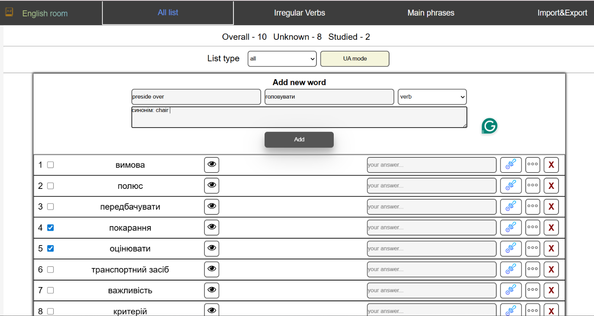

# New English Room 🇬🇧🇺🇦

**New English Room** is a functional React-based application designed for efficient English language learning. Developed as a personal trainer for vocabulary expansion, spelling practice, and mastering common idioms, the app is actively used by the author and a group of users for daily language practice.

🚀 **Live Demo:** [View Project](https://olehkuts.github.io/new_english_room/)

---

## 📸 Screenshots


_Interface of the "All list" page: dictionary overview and the "Add New Word" workflow._

---

## ✨ Key Sections & Features

The application is divided into specialized modules for a comprehensive learning experience:

### 1. All List (Core Dictionary)

The heart of the application, offering full control over your personal vocabulary:

- **Full CRUD Operations:** Add, edit, and delete words, including part-of-speech tags.
- **Advanced Sorting:** Sort by alphabet, time added, part of speech, or random (Shuffle) mode.
- **Learning Tools:**
  - **Spelling Check:** Test your writing accuracy for any word in your list.
  - **Reverse Learning Mode:** Toggle between ENG-UA and UA-ENG directions.
  - **Status Tracking:** Mark words as "learned" or "unlearned" to focus your efforts.

### 2. Irregular Verbs

An interactive reference table containing the most common English irregular verbs with translations for quick lookup and memorization.

### 3. Main Phrases

A curated collection of over 200 essential English phrases and sentences. It includes a self-test feature where users can toggle the visibility of translations.

### 4. Import & Export (Data Portability)

Complete ownership of your learning data:

- **Export:** Save your entire dictionary into a `.json` text file.
- **Import:** Restore previously saved data or migrate it to another device/browser.

---

## 🛠 Tech Stack

- **Core:** React (Functional Components).
- **State & Logic:**
  - **Custom Hooks:** Business logic and state management are extracted into custom hooks for better maintainability and cleaner components.
  - **Local Storage API:** Persistent data storage directly in the browser, enabling a full-featured experience without a dedicated backend.
- **Libraries:**
  - `uuid` — for generating unique identifiers for dictionary entries.
  - `copy-to-clipboard` — for seamless copying of phrases and vocabulary.

---

## 💡 Technical Highlights

1.  **Modular Architecture:** Built with functional components and a focus on the separation of concerns.
2.  **Logic Separation:** Complex filtering and sorting logic are decoupled from the UI, making the codebase scalable.
3.  **Offline-First Experience:** Since data is handled via `LocalStorage`, the app works instantly and retains all user progress between browser sessions.

---

## 🚀 Local Setup and Installation

1. Clone the repository:
   ```bash
   git clone https://github.com
   ```
2. Navigate to the project directory:
   ```bash
   cd new_english_room
   ```
3. Install dependencies:
   ```bash
   npm install
   ```
4. Start the development server:
   ```bash
   npm start
   ```

_Developed by [Oleh Kuts](https://github.com/OlehKuts)_
